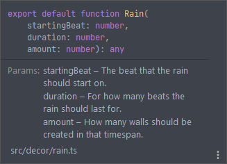

<div align="center"></div>
<hr>
<div align="left"> 

The all around modchart helper that contains functions and utilities created by the community.

These scripts are designed to be used with [Remapper](https://github.com/Swifter1243/ReMapper).

## Installation

In your map project folder, run the following

```bash
$ npm install nootils
# or if you use yarn
$ yarn add nootils
```

## Usage

Nootils should be used after a map is opened by Remapper, an example can be seen down below:

```ts
import * as Remapper from 'swifter_remapper'
import * as Nootils from 'nootils'

const map = new Remapper.Difficulty("INPUT.dat", "OUTPUT.dat");

// Start of script, unsert your script below this line.

Nootils.Rain(0, 20, 300) // This will add the rain effect to the opened map using magic (Remapper.activeDiff)

// End of script, insert your script above this line.

map.save();
```

You can import all functions Nootils provides by using the following import statement:

```ts
import * as Nootils from 'nootils'

Nootils.Rain(0, 20, 300)
```

If you want to use individual functions instead, you can import each function as you need like so:

```ts
import {Rain} from 'nootils'

Rain(0, 20, 300)
```

All Nootils functions are documented using JSDoc allowing you to view documentation in an IDE using intellisense:

<div align="center"></div>

</div>
